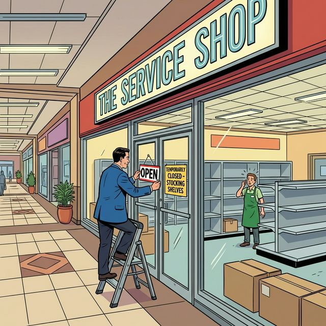

# 📦 The Health Inspector - Readiness Probes

This comic explains the "Stocked Shelves" analogy for **Readiness Probes**.

## 🛍️ Mall Analogy

- **The Shop** → A Kubernetes Pod.
- **The Customer** → Network traffic/requests.
- **The Manager** → Kubernetes (Control Plane).
- **The "Open" Sign** → Readiness status.
- **Empty Shelves** → An application that is running (alive) but not yet ready to serve requests (e.g., still loading data).

## 🧠 Key Takeaway

A **Readiness Probe** determines if a Pod should receive traffic. If the shelves are empty, the manager takes down the "Open" sign (removes the Pod from the Service's Endpoints), but the shop stays in the building (the Pod is NOT restarted).

---

## 🔗 References
- Lab → [LAB 01 – Liveness Probes: The Health Inspector](../../../../practice/labs/ch14-probes/lab01-liveness-probes-health-inspector/README.md)
- Chapter → [Chapter 14: Probes & Health Checks](../../../sources/study-guide/ch14-probes.md)
