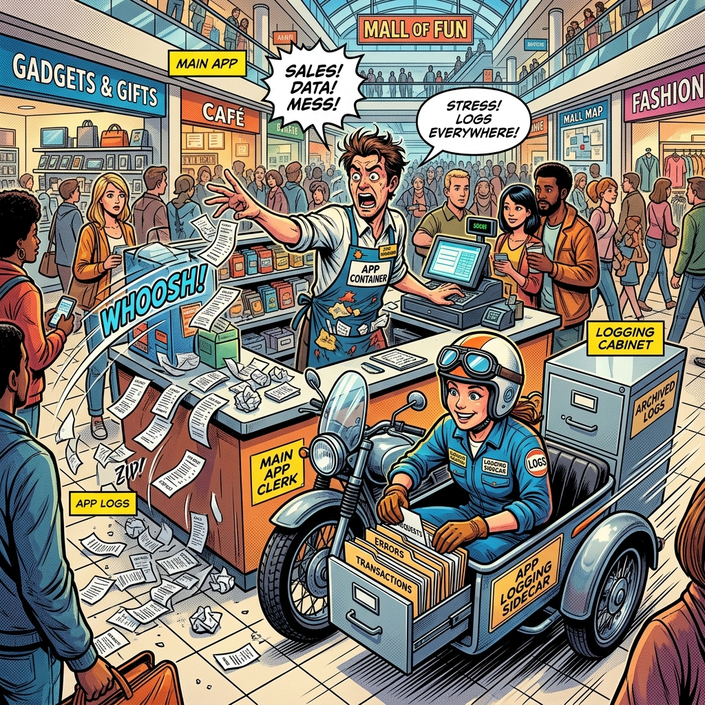

# 🎨 Section 15.2: Logging Sidecars

*The Frantic Clerk & The Dedicated Helper!*

---

### 📖 The Mall Analogy Reference

In the **Central Mall**, some shops process so many transactions that the main clerk can't handle both selling items and keeping the receipts organized.

| Concept | Mall Analogy | Role |
| :--- | :--- | :--- |
| **Main App Container** | **The Frantic Clerk** | Focused entirely on serving customers (handling requests), dropping receipts on the floor. |
| **Logging Sidecar Container** | **The Dedicated Helper** | A secondary worker in the same shop whose only job is to pick up the receipts and file them away neatly. |
| **Shared Volume** | **The Floor / Desk** | Where the clerk drops the receipts so the helper can see and collect them. |

---

## 🧠 CKAD Troubleshooting Logic

If a logging sidecar pattern is failing, check the following:
1. **The Shared Desk**: Make sure both containers in the [Pod](../../../../GLOSSARY.md#pod) have the same Volume mounted to the right paths. If the helper is looking in the cabinet but the clerk is throwing receipts on the floor, it won't work!
2. **Accessing the Logs**: When viewing CCTV tapes for a multi-container pod, you must specify which worker you want to watch: `kubectl logs <pod-name> -c <container-name>`.

---

- **Study Guide** → [Chapter 15: Debugging](../../../../sources/study-guide/ch15-debugging.md)
- **Practice Lab** → [Lab 02: Logging Sidecars](../../../../practice/labs/ch15-debugging/lab02-logging-sidecars/README.md)

---
[Mall Directory ✨](../../../../GLOSSARY.md)
