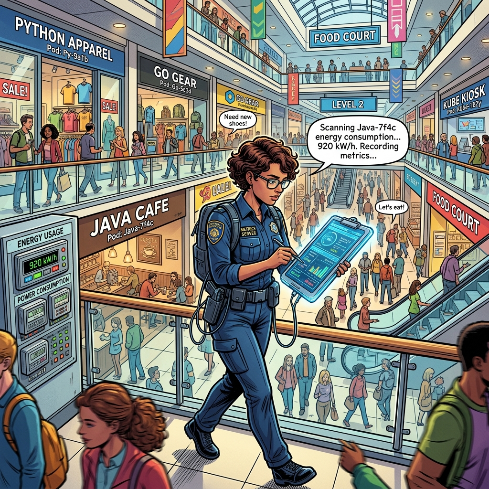

# 🎨 Section 15.3: Metrics Server

*The Mall Inspector & The Electricity Meters!*

---

### 📖 The Mall Analogy Reference

In the **Central Mall**, the Mall Owner needs to know which shops are consuming too much power and which are sitting empty.

| Concept | Mall Analogy | Role |
| :--- | :--- | :--- |
| **Metrics Server** | **The Mall Inspector** | Walks around the mall with a clipboard, taking notes on resource usage. |
| **Resource Usage (CPU/Memory)** | **Electricity & Water** | The essential utilities a shop needs to function. |
| **`kubectl top`** | **Asking the Inspector** | Requesting the current utility bill for a specific shop or the whole building. |

---

## 🧠 CKAD Troubleshooting Logic

When debugging performance issues:
1. **Ask the Inspector**: Use `kubectl top pods` or `kubectl top nodes` to find out who is using the most resources.
2. **Missing Inspector**: If `kubectl top` fails, it usually means the Metrics Server is not installed or the pods are crashing. Check `kube-system` namespace to ensure the Metrics Server is running.
3. **Wait a Minute**: The inspector takes time to walk around the mall. If you just opened a shop, wait 60 seconds before asking for the utility bill!

---

- **Study Guide** → [Chapter 15: Debugging](../../../../sources/study-guide/ch15-debugging.md)
- **Practice Lab** → [Lab 03: Metrics Server](../../../../practice/labs/ch15-debugging/lab03-metrics-server/README.md)

---
[Mall Directory ✨](../../../../GLOSSARY.md)
