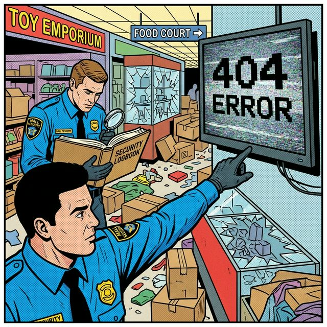

# 🖼️ Comic: The Broken Shop
## Chapter 15: Debugging – Investigation

This comic explains the **CSI (Crime Scene Investigation)** approach to troubleshooting pods in the Central Mall.

---

## 🛍️ Mall Analogy

- **The Crime Scene** → A shop that is dark, locked (`Pending`), or has a "Closed" sign (`CrashLoopBackOff`).
- **The Logbook (describe)** → Checking the Mall Manager's official incident reports. It will tell you if the "Image" (Uniform) was never delivered or if the "Node" (Building) is out of power.
- **CCTV Tapes (logs)** → Seeing what the worker was doing *inside* the shop right before they fainted. Usually reveals application-level errors.
- **Physical Inspection (exec)** → Entering the shop with a flashlight to check the inventory and internal settings manually.

> 🛍️ *Check the logbook first; the CCTV second; the floor third.*

---

## 🧠 Key Takeaways

- **Order of Operations:** Always check `describe pod` first to rule out infrastructure issues (Scheduling, Storage, Network, Images).
- **Application Context:** `logs` are for seeing what the container itself is saying. If the pod is crashing, use `--previous` to see the logs from the last failed attempt.
- **Interactivity:** `kubectl exec -it` is the "last resort" for verifying connectivity or file contents that aren't apparent from logs.
- **CKAD Tip:** Learn to skim `describe` output for the "Events" section. It's the most valuable part for diagnosing why a pod won't start.

---

## 🔗 References
- **Study Guide** → [Chapter 15: Debugging & Logs](../../../../sources/study-guide/ch15-debugging.md)
- **Lab** → [Lab 01 - Debugging Shop](../../../../practice/labs/ch15-debugging/lab01-debugging-shop/README.md)
- **Docs** → [Troubleshooting Guide](../../../../reference/md-resources/troubleshooting-kubernetes.md)

---
[Mall Directory ✨](../../../../GLOSSARY.md) | [🔙 Back](javascript:history.back())
