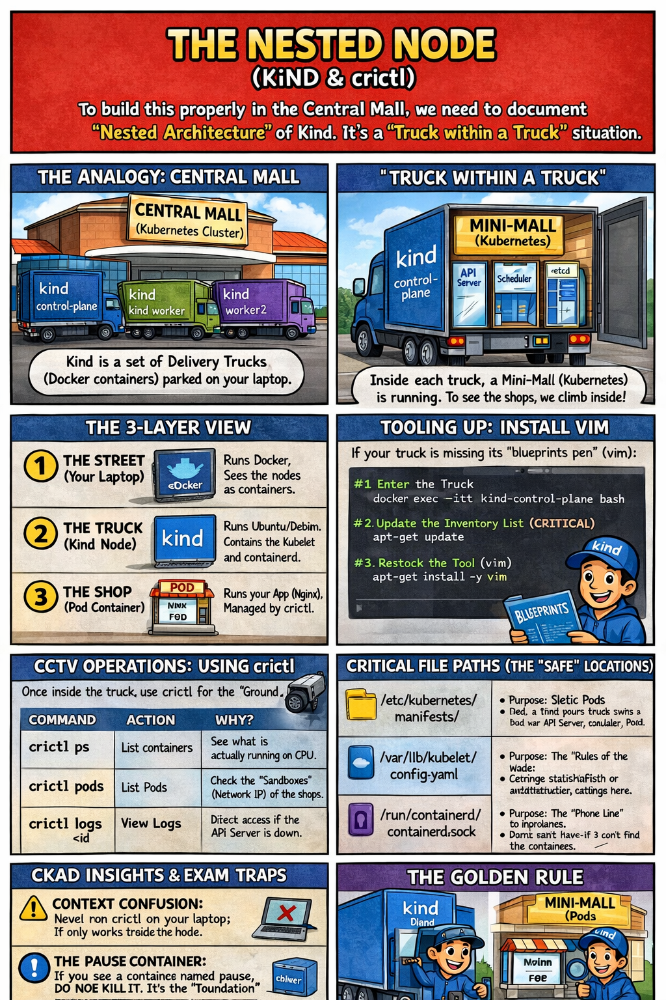

# 🖼️ Comic: The Nested Node (Kind & crictl)
## Chapter 15: Debugging – Node Debugging & CCTV

When the standard mall intercom is broken, you have to go "under the hood" to see the shops directly inside the delivery trucks.

---

## 🛍️ Mall Analogy

In the **Central Mall**, Kind is like a set of **Delivery Trucks** (Docker containers) parked in the loading dock. 

- **The Street (Laptop):** Runs Docker. From here, you only see the trucks, not what's inside them.
- **The Truck (Kind Node):** Runs Ubuntu/Debian. Inside each truck, a Mini-Mall (Kubernetes) is running. 
- **The Shop (Pod Container):** To see the individual shops, you have to climb into the truck!

To troubleshoot when the Mall Manager (API Server) is unreachable, you use the **Internal CCTV** (`crictl`).

---

## 🔍 CCTV Operations: Using `crictl`

Once inside the truck, use `crictl` to see the "Ground Truth" of what's happening on the floor.

| CCTV Tool | Action | Purpose |
|---------|--------|------|
| `crictl ps` | List containers | See which worker is actually at their station. |
| `crictl pods` | List Pods | Check the "Sandboxes" (the physical shop structures). |
| `crictl logs` | View Logs | Direct access to the container logs if the central office is closed. |

---

## 🧠 CKAD Insights & Exam Traps

> **Context Confusion:** Never run `crictl` on your laptop! It only works **inside** the Node. If you try it on the street, you'll see nothing.

- **The Pause Container:** If you see a container named `pause`, do **not** kill it. It’s the "Foundation" of the Pod’s network. Without it, the shop has no intercom or electricity.
- **Static Pods:** If you need to fix a critical mall component (like the API Server), you must drop the blueprints in `/etc/kubernetes/manifests/`.

---

## 🔗 References
- **Study Guide** → [Chapter 15: Debugging](../../../../sources/study-guide/ch15-debugging.md)
- **Lab** → [Lab 04 - The Nested Node](../../../../practice/labs/ch15-debugging/lab04-nested-nodes-crictl/README.md)
- **Official Docs** → [crictl CLI](https://kubernetes.io/docs/tasks/debug/debug-cluster/crictl/)

---
[Mall Directory ✨](../../../../GLOSSARY.md)
