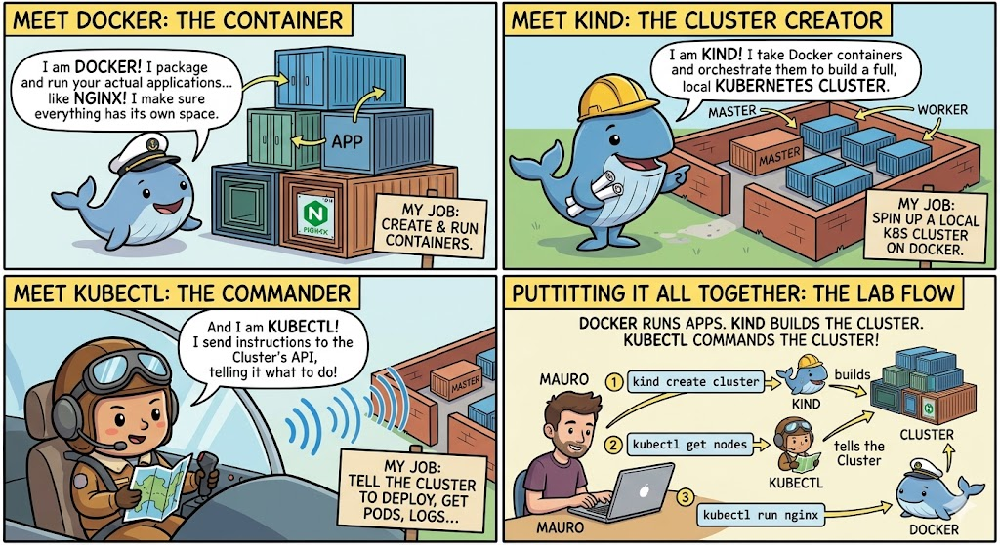

# 🎨 Section 15.5: The Connection Crisis

*The Broken Compass, The Renovation & The VPN Jammer!*

---

### 📖 The Connection Analogy Reference

In the **Central Mall**, staying connected depends on having the right map and no security gates blocking your path.

| Concept | Mall Analogy | Role |
| :--- | :--- | :--- |
| **Kubeconfig** | **The Store Directory (The Map)** | Tells you exactly where each shop is located. |
| **Docker Host Port** | **The Mall Aisle** | The physical location on your laptop where the cluster is listening. |
| **Kind Cluster** | **The Mall Building** | The infrastructure housing all the shops. |
| **VPN / Firewall** | **The Security Gate / Jammer** | Blocks the main entrance, forcing you to find the service entry. |
| **Internal IP** | **The Service Entrance** | A back-way into the mall that bypasses the security gate. |

---

## 🧠 CKAD Troubleshooting Logic

1. **Verify the Physical Address:** Did the mall move to a new aisle (Port Drift)?
2. **Bypass the Jammer:** Is the main gate locked (VPN blocking loopback)? Use the Service Entrance (Internal IP).
3. **Update the Map:** Rewrite your `~/.kube/config` to match the new reality.

---

## 🔗 References
- **Study Guide** → [Chapter 15: Debugging](../../../../sources/study-guide/ch15-debugging.md)
- **Practice Lab** → [Lab 05: Connection Crisis](../../../../practice/labs/ch15-debugging/lab05-the-connection-crisis/README.md)

---
[Mall Directory ✨](../../../../GLOSSARY.md) | [🔙 Back](javascript:history.back())
