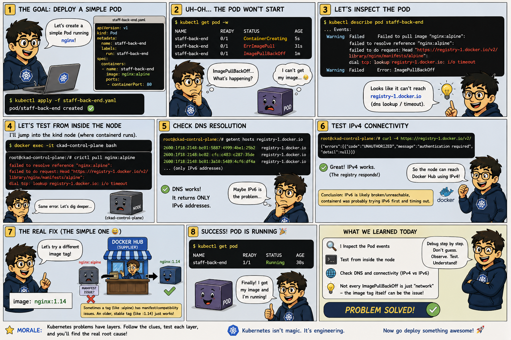

# 🎨 Section 15.6: The IPv6 Illusion (ImagePullBackOff)

*The Lost Delivery Truck & The Unfinished Highway!*

---

### 📖 The Delivery Analogy Reference

In the **Central Mall**, when a new shop opens, the **Mall Manager** (Control Plane) orders the **Mannequins & Goods** (Container Images) from the **Central Warehouse** (Docker Hub). The delivery trucks must take the highway to reach the mall.

| Concept | Mall Analogy | Role |
| :--- | :--- | :--- |
| **Container Image (`nginx:alpine`)** | **The Goods / Mannequins** | The actual stuff needed to run the shop. |
| **Container Registry (`registry-1.docker.io`)** | **The Central Warehouse** | Where the goods are stored globally. |
| **IPv6 Resolution** | **The Unfinished Highway** | A new, faster road that GPS suggests, but is sometimes closed or broken. |
| **IPv4 Resolution (`curl -4`)** | **The Old Reliable Highway** | The classic road that always works. |
| **`crictl pull`** | **The Delivery Truck** | The vehicle sent to fetch the goods directly by the Node's manager. |

---

## 🧠 CKAD Troubleshooting Logic

1. **Check the Shop Door (`kubectl describe pod`)**: You see `ErrImagePull` or `ImagePullBackOff` and an `i/o timeout` mentioning `registry-1.docker.io`.
2. **Walk to the Loading Dock (`docker exec -it <node> bash`)**: Enter the actual Node to see if the problem is local to the cluster or specific to the Node's network.
3. **Dispatch a Manual Truck (`crictl pull <image>`)**: Test the exact action the Manager was attempting. It fails with the same timeout.
4. **Check the GPS (`getent hosts registry-1.docker.io`)**: You see IPv6 addresses (the unfinished highway).
5. **Test the Old Highway (`curl -4 <registry>`)**: It connects instantly (returns `UNAUTHORIZED` instead of timing out, meaning the server was reached successfully).

### 💡 The Resolution

The Node is trying to use an IPv6 route to the Docker Registry, but the network drops the packets. 
To fix it, you can either:
- **Avoid the broken road:** Disable IPv6 on the Node so it falls back to IPv4.
- **Cancel the delivery:** Use a different image tag (like `nginx:1.14`) that might already be cached locally on the Node, avoiding the warehouse trip entirely!

---

- **Study Guide** → [Chapter 15: Debugging](../../../../sources/study-guide/ch15-debugging.md)
- **Practice Lab** → [Lab 01: Debugging Shop](../../../../practice/labs/ch15-debugging/lab01-debugging-shop/README.md)

---
[Mall Directory ✨](../../../../GLOSSARY.md)
