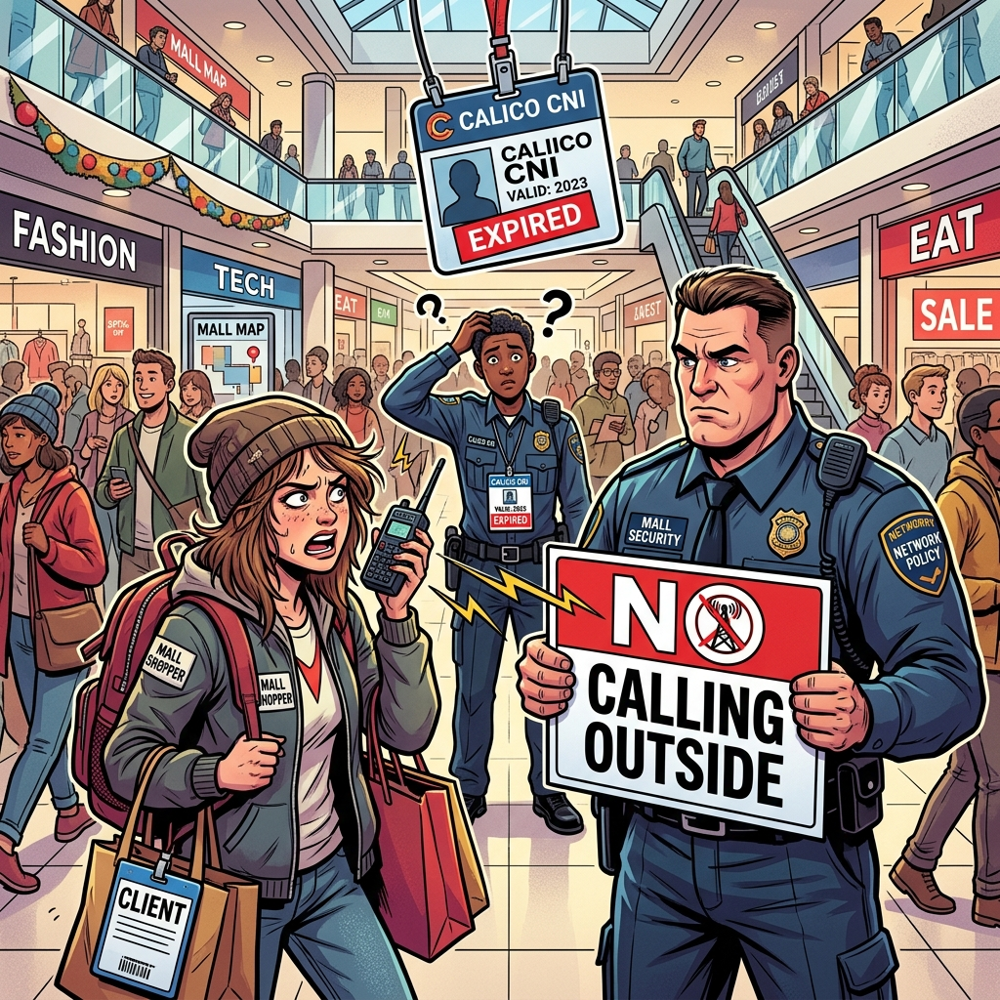

# 🎨 Section 15.7: The Security Guard Strike (CNI & NetPol)

*The VIP Guest List & The Expired ID Badge!*

---

### 📖 The Mall Analogy Reference

In the **Central Mall**, two types of security layers manage how shops communicate:

| Concept | Mall Analogy | Role |
| :--- | :--- | :--- |
| **CNI (Calico)** | **The Security & Radio Dispatch** | Gives every new shop a walkie-talkie (IP address) and a spot on the mall map. |
| **NetworkPolicy** | **The VIP Access List** | The strict rules governing who can enter the VIP Lounge (the namespace). |
| **Egress Traffic** | **Calling Outside** | When a guest tries to call Directory Assistance (CoreDNS) for directions. |
| **Unauthorized Connection** | **Expired ID Badge** | The dispatcher’s badge expired, so they refuse to give the new shop a walkie-talkie. |

---

## 🧠 CKAD Troubleshooting Logic

1. **The Expired Badge (CNI Issue)**: When a connection is `unauthorized`, it’s like the Security Dispatcher's ID badge expired. Deleting the Calico pods forces them to get new badges from the Mall Owner (API Server).
2. **The VIP Lounge Trap (NetworkPolicy Egress)**: Once you write an "Allow" rule for who can enter the VIP lounge, the mall accidentally locks the exits for the guests! If you lock down a namespace, you **must** explicitly allow Egress to `kube-system` on port `53` (TCP/UDP) so your Pods can resolve Service names.

---

- **Study Guide** → [Chapter 13: Network Policies](../../../../sources/study-guide/ch13-networking.md)
- **Study Guide** → [Chapter 15: Debugging](../../../../sources/study-guide/ch15-debugging.md)
- **Practice Lab** → [Lab 07: Security Guard Strike](../../../../practice/labs/ch15-debugging/lab07-security-guard-strike/README.md)

---
[Mall Directory ✨](../../../../GLOSSARY.md)
