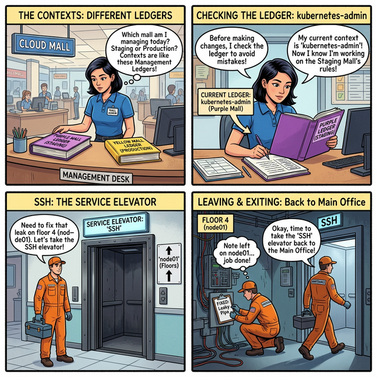

# 🔑 Mall Logistics: SSH and Contexts
*Navigating the Central Mall Infrastructure*

## 📖 The Developer's Translation

This comic illustrates the difference between **SSH** and **Kubectl Contexts**, which are critical concepts for the CKAD exam.

### Panel 1 & 2: The Contexts (Management Ledgers)
* **The Analogy:** The Mall Manager has multiple ledgers for different wings of the mall or even entirely different malls (e.g., Purple Wing vs. Yellow Wing, or Staging vs. Production). They must check which ledger they are currently writing in to avoid applying rules to the wrong place.
* **The Reality:** A **Kubectl Context** tells your `kubectl` tool which Kubernetes cluster and namespace you are currently interacting with. Always check your context (`kubectl config current-context`) before making changes!

### Panel 3 & 4: SSH (The Service Elevator)
* **The Analogy:** Sometimes you can't just send an order from the main desk; you physically need to take the service elevator to a specific floor to fix a leaky pipe, and then you must remember to take the elevator back up to the main office.
* **The Reality:** **SSH** is used to securely connect directly to a specific Node in the cluster (e.g., `ssh node01`). When you are SShed into a node, you are operating on that specific machine's OS, not via the Kubernetes API. You must type `exit` to return to your main terminal (usually the control plane) when finished.

---
[Review the full study guide for SSH and Contexts](../../../../reference/md-resources/ckad-exam/05-ssh-and-contexts.md)
